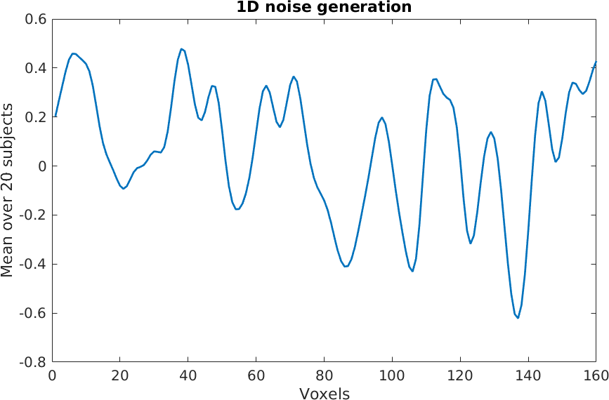
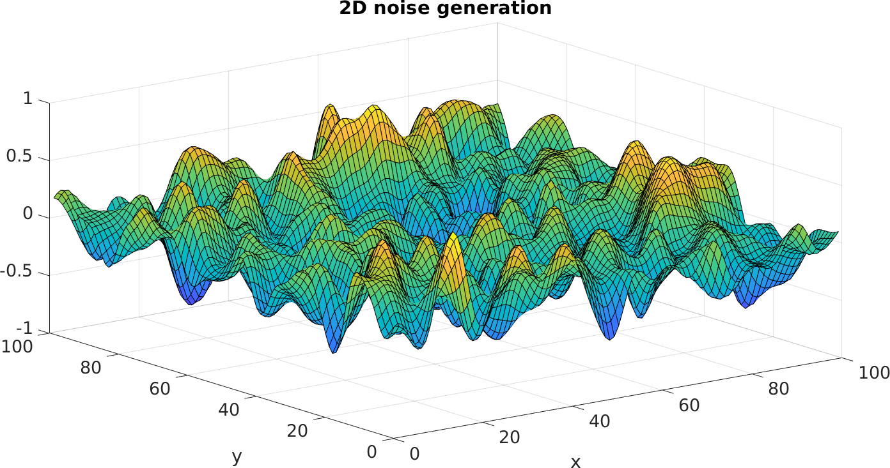
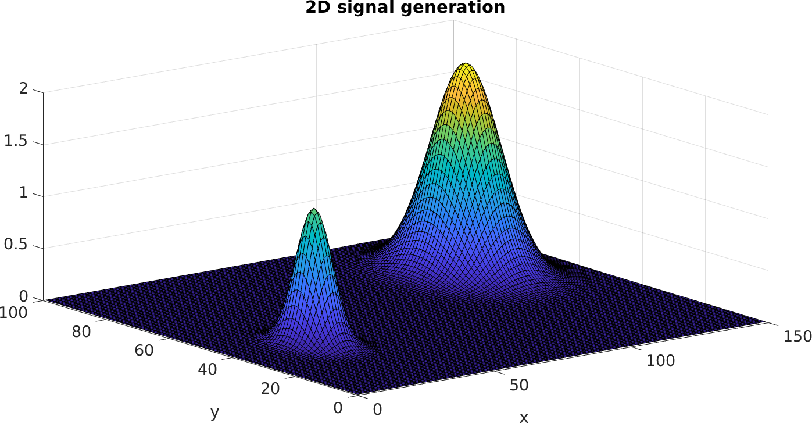

# RFTtoolbox (Beta Version): A toolbox designed for generation and analysis of random fields both continuously sampled and on a lattice.
The RFTtoolbox currently contains code to perform image based inference using the tools of Random Field Theory. In particular it contains code to 
perform FWER inference using the Expected Euler characteristic, generate random fields with a variety of stationary and non-stationary covariance structures and a number of further features.

Feel free to use the functions available in your research. However if you do please cite us.

## Table of contents
* [Installation](#setup)
* [Folder Structure](#folderstruct)
    * [Cluster_Size_Inference](#CLInf)
    * [Convolution_Fields](#Convfields)
    * [Peak_Inference](#PI)
    * [Random_Field_Generation](#RFfunctions)
    * [RFT_functions](#siggen)
    * [SPM_Functions](#power)

## Installation <a name="setup"></a>
In order to install either download the zip file or run
git clone https://github.com/sjdavenport/RFTtoolbox/ from the commmand line.

Then in order to use the package, once you're in matlab you'll first need to add all the functions to the matlab path. 
If you have installed the package in the directory: dir, then to do so you need to run: addpath(genpath('dir')) within matlab.


### Compiling C code
In order to compile the c-code required to efficiently run the hermite projector estimator
you will need to navigate to the folder EEC/csource/ and run
```
mex EulerCharCrit_c.cpp
```
you may need to install the MATLAB C/C++ compiler for your system in order to do this.
MATLAB give you instructions on how to do so in an error message obtained from 
running the above code.

## Folder Structure <a name="folderstruct"></a>

### Cluster Size Inference <a name="CLInf"></a>

A collection of functions to perform cluster size inference using random 
field theory. Many more functions will be added to this folder.

### Convolution Fields <a name="Convfields"></a>

Functions to generate and infer on convolution fields. 

### Peak Inference <a name="PI"></a>

A collection of functions to perform peak inference on random fields. 

### Random Field Generation <a name="RFfunctions"></a>

Functions to generate isotropic random fields (and to generate the signal 
for them if you'd like this to be non-zero).

#### noisegen.m
noisegen generates (a specified number of) smooth mean zero Gaussian fields 
with a specified dimension (D = 1, 2 or 3) that have variance 1 and are 
smoothed with an isotropic Gaussian kernel with given FWHM.

The mean of 20 Gaussian random fields generated on a grid of 1x160 with 
an isotropic Gaussian kernel with FWHM 6:
```
noise = noisegen(160,20,6);
plot(mean(noise,2), 'linewidth', 2)
```



The mean of 20 Gaussian random fields generated on a grid of 100x100 with 
an isotropic Gaussian kernel with FWHM 6:
```
Dim = [100,100]
noise = noisegen(Dim, 20, 6);
noise_mean = mean(noise,3);
surf(noise_mean)
```


#### genRF.m
genRF returns a set of isotropic random fields (either Gaussian, t or 
F-fields) which have a specified number of degrees of freedom and smoothing.


#### gensig.m
gensig generates signal with peaks at locations within an image of specified 
dimension D = 1,2 or 3. It provides control over the extent, shape and magnitude of each peak.
Below we provide a 2D illustration involving 2 peaks.

```
peak_magnitudes = [1.3,2]
radii = 3;
smoothing = [10,20];
image_dimensions = [100,150];
peak_locations =  {[40,30], [70,120]}

Sig = gensig(peak_magnitudes, radii, smoothing, image_dimensions, peak_locations);
surf(Sig)
```


